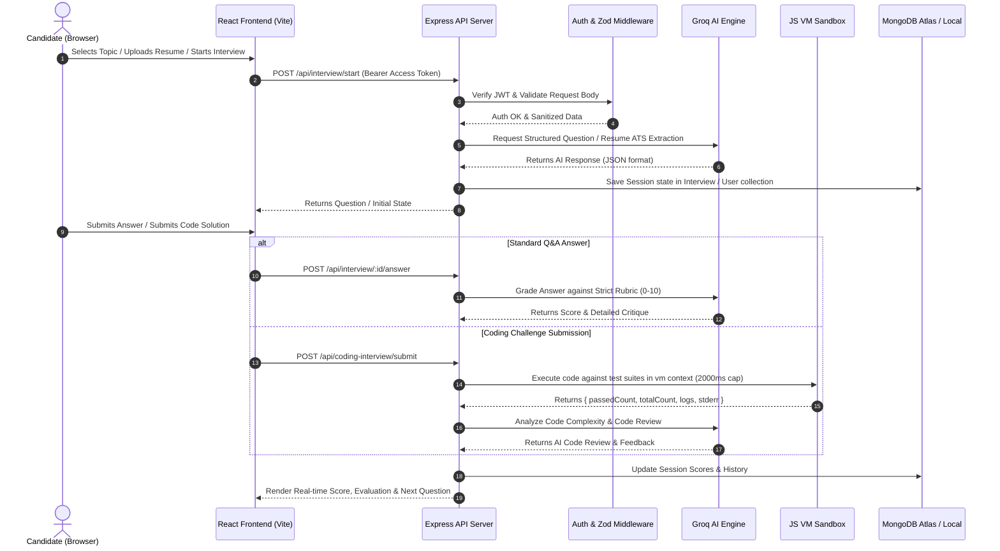

# 🚀 PrepPilot-AI — Comprehensive Project Documentation & Architecture Specification

> **Platform Name:** PrepPilot-AI (AI-Powered Technical Interview Copilot)  
> **Repository:** `nitinpcs/PrepPilot-AI`  
> **Target Audience:** Software Engineering Candidates, Computer Science Students, Hiring Managers & Technical Recruiters  
> **Documentation Version:** 1.0.0  
> **Last Updated:** October 2026  

---

## 📋 Table of Contents

1. [Executive Summary & Product Vision](#1-executive-summary--product-vision)
2. [What, Why & How — Core Engineering Philosophy](#2-what-why--how--core-engineering-philosophy)
3. [Complete Feature Matrix](#3-complete-feature-matrix)
4. [Technology Stack & Dependency Blueprint](#4-technology-stack--dependency-blueprint)
   - [Backend Dependencies & Why They Were Chosen](#41-backend-dependencies--why-they-were-chosen)
   - [Frontend Dependencies & Why They Were Chosen](#42-frontend-dependencies--why-they-were-chosen)
5. [System Architecture & Data Flow](#5-system-architecture--data-flow)
6. [Core Engine Deep-Dives](#6-core-engine-deep-dives)
   - [6.1 Groq AI Engine & Multi-Model Failover Protocol](#61-groq-ai-engine--multi-model-failover-protocol)
   - [6.2 In-Memory JavaScript Code Execution Sandbox](#62-in-memory-javascript-code-execution-sandbox)
   - [6.3 ATS Resume Parsing & Structured Profile Extraction](#63-ats-resume-parsing--structured-profile-extraction)
   - [6.4 Dynamic PDF Scorecard Generator](#64-dynamic-pdf-scorecard-generator)
   - [6.5 Dual-Token JWT & OTP Security Architecture](#65-dual-token-jwt--otp-security-architecture)
7. [Database Schemas & Data Models](#7-database-schemas--data-models)
8. [API Reference & Route Specifications](#8-api-reference--route-specifications)
9. [Frontend Design System & UX Architecture](#9-frontend-design-system--ux-architecture)
10. [Environment Setup & Installation Guide](#10-environment-setup--installation-guide)

---

## 1. Executive Summary & Product Vision

### WHAT is PrepPilot-AI?
**PrepPilot-AI** is a state-of-the-art, full-stack web application designed to deliver realistic, strict, and adaptive technical interview simulations for software engineers. It combines generative AI models, automated resume parsing, real-time code execution, company-specific interview profiling, and automated scorecard generation into a single glassmorphic workspace.

### WHY was it built?
Traditional interview preparation (such as memorizing static LeetCode answers or standard Q&A cheat sheets) fails to simulate the dynamic, unpredictable, and rigorous nature of actual technical screenings at top tech companies. Candidates often lack feedback on:
- **Depth & Accuracy**: Distinguishing generic buzzword responses from concrete technical trade-offs.
- **Resume Probing**: Handling technical questions tailored directly to their past projects and claimed skills.
- **Company Alignment**: Adapting to specific interview formats (e.g., FAANG coding/theory ratios vs. startup full-stack evaluations).
- **Time-bound Live Coding**: Writing clean, efficient code under timer constraints with immediate test case feedback and automated complexity analysis.

PrepPilot-AI bridges this gap by acting as an objective, un-biased, 24/7 Senior Engineering Interviewer that evaluates candidates with calibrated rubrics rather than artificial grade inflation.

---

## 2. What, Why & How — Core Engineering Philosophy

| Question | Engineering Decision | Technical Implementation |
| :--- | :--- | :--- |
| **WHAT model powers the AI interviewer?** | Groq's high-speed inference engine using ultra-fast LLMs (`openai/gpt-oss-120b`, `openai/gpt-oss-20b`, `qwen/qwen3.8-27b`). | Custom `chatCompletion` pipeline in [`groqService.js`](file:///c:/Users/Nitin/Desktop/AI_COPILOT/backend/services/groqService.js) with structured JSON enforcement and automatic failover. |
| **WHY use Groq over standard OpenAI or Anthropic endpoints?** | Groq provides sub-100ms token generation latency, essential for conversational flow without frustrating wait times during live Q&A sessions. | Standard Groq SDK (`groq-sdk`) integrated via ES Modules in Node.js. |
| **HOW does the system prevent crashes when Groq deprecates a model?** | A self-healing multi-model failover array that catches `404` / `model_not_found` errors and dynamically retries down the fallback chain. | Safe error-catching loop in `chatCompletion` iterating through candidate models before throwing exceptions. |
| **WHAT handles live code execution?** | Node.js native `vm` module combined with timed sandboxes. | [`codingInterviewService.js`](file:///c:/Users/Nitin/Desktop/AI_COPILOT/backend/services/codingInterviewService.js) executes untrusted code with console capture, timeout caps (2000ms), and custom assertion testing. |
| **WHY build custom PDF generation instead of client HTML printing?** | Server-side PDF generation ensures pixel-perfect vector scorecards, brand consistency, exact page layouts, and secure document creation without browser print dialog dependency. | Built with `pdfkit` in [`reportPdfService.js`](file:///c:/Users/Nitin/Desktop/AI_COPILOT/backend/services/reportPdfService.js). |
| **HOW is user authentication secured?** | Short-lived JWT Access Tokens + HTTP-only Refresh Tokens + bcrypt password hashing + 6-digit OTP email verification with rate limiting. | Implemented via `express-rate-limit`, `nodemailer`, `jsonwebtoken`, and custom auth middleware. |

---

## 3. Complete Feature Matrix

```
PrepPilot-AI Feature Suite
├── 🔐 Authentication & Security Engine
│   ├── User Registration & Login with Password Hashing (bcryptjs)
│   ├── Dual JWT Architecture (15m Access Token / 7d Refresh Token)
│   ├── OTP Verification via SMTP (Nodemailer) with Console Fallback for Local Dev
│   ├── Rate-Limiting on Sensitive Auth Endpoints (max 5 OTP requests per window)
│   └── Input Sanitization & Validation (Zod Schemas)
│
├── 🎯 Domain & Role-Based Mock Interviews
│   ├── Topic-Based Screening (Node.js, React, System Design, Data Structures, Python, SQL)
│   ├── Role-Based Targeting (Frontend, Backend, Full Stack, DevOps, System Architect)
│   ├── Adaptive Question Scaling (Probes deep concepts if candidate scores high; reviews fundamentals if low)
│   └── Strict Scoring Policy (0-10 calibrated scale penalizing hand-waving and generic buzzwords)
│
├── 📄 ATS Resume Parsing & Profile Deep-Dive
│   ├── Drag-and-Drop Resume PDF Upload
│   ├── Multi-Page Text Extraction (`pdf-parse`)
│   ├── LLM-Powered ATS Structuring (Skills, Technologies, Experience, Projects, Summary)
│   └── Resume-Targeted Technical Interview Mode (Questions target candidate's real project stack)
│
├── 🏢 Company-Specific Interview Simulations
│   ├── Company Profiles (Google, Amazon, Meta, Microsoft, Netflix, Apple, Uber, Early-Stage Startups)
│   ├── Round Configuration (Coding vs. Theory Ratios, Behavioral Emphasis, Specific Evaluation Criteria)
│   └── Realistic Company Feedback & Cultural Fit Assessment
│
├── 💻 Live Interactive Coding IDE Workspace
│   ├── Monaco Editor Integration (VS Code experience in browser)
│   ├── Multi-Theme & Language Support (JavaScript Node.js runtime environment)
│   ├── Automated Test Runner (Executes visible and hidden test suites in isolated Node `vm` context)
│   ├── Timeout & Memory Safety Caps (Prevents infinite loops and process crashes)
│   └── AI Code Review (Evaluates time/space complexity, readability, clean code, edge cases)
│
└── 📊 Performance Analytics & Dynamic PDF Scorecard
    ├── Interactive Candidate Dashboard (Average score, session history, target company tracker)
    ├── Per-Question Detailed Feedback & Breakdown
    ├── Multi-Metric Assessment (Technical Depth, Problem Solving, Communication, Company Fit)
    ├── Personalized 3-5 Step Learning Roadmap & Recommended Practice Questions
    └── Server-Side Downloadable Vector PDF Report Generation (`pdfkit`)
```

---

## 4. Technology Stack & Dependency Blueprint

### 4.1 Backend Dependencies & Why They Were Chosen

The backend is built as a RESTful API using **Node.js** with **ES Modules (`"type": "module"`)** and **Express.js**.

```json
"dependencies": {
  "bcryptjs": "^2.4.3",
  "cors": "^2.8.5",
  "dotenv": "^16.4.5",
  "express": "^4.19.2",
  "express-rate-limit": "^7.2.0",
  "groq-sdk": "^1.3.0",
  "helmet": "^7.2.0",
  "jsonwebtoken": "^9.0.2",
  "mongoose": "^8.4.1",
  "morgan": "^1.10.0",
  "nodemailer": "^6.9.13",
  "pdf-parse": "^1.1.1",
  "pdfkit": "^0.19.1",
  "zod": "^4.4.3"
}
```

| Dependency | Purpose | Why Chosen Over Alternatives |
| :--- | :--- | :--- |
| **`express`** | Core HTTP Web Server | Industry standard for Node.js, unopinionated routing middleware, lightweight, and highly performant. |
| **`mongoose`** | MongoDB ODM (Object Data Modeling) | Provides strict schema validation, type casting, query building, and document hooks for MongoDB. |
| **`groq-sdk`** | Official Groq LLM Client | Direct client library for Groq's high-speed LPU (Language Processing Unit) endpoints, offering sub-100ms inference response times. |
| **`zod`** | Schema-First Data Validation | TypeScript-friendly runtime validation. Used in [`validate.js`](file:///c:/Users/Nitin/Desktop/AI_COPILOT/backend/middleware/validate.js) to catch malformed request bodies before hit controllers. Superior to Joi due to zero dependencies and modern composability. |
| **`bcryptjs`** | Password Hashing | Pure JavaScript implementation of `bcrypt`. Hash salt factor 10 prevents rainbow table attacks without native compilation overhead. |
| **`jsonwebtoken`** | JWT Token Generation & Verification | Standard token format for stateless authentication. Supports expiration timestamps and digital signature verification (`HS256`). |
| **`pdfkit`** | Server-Side Vector PDF Generator | Creates clean, downloadable PDF scorecards entirely on the server with exact margins, vector boxes, colors, and typography. |
| **`pdf-parse`** | Server-Side PDF Text Extractor | Extracts raw string content from candidate PDF resumes for ATS analysis without requiring external binary tools like Poppler. |
| **`nodemailer`** | Automated Email Delivery | Sends 6-digit OTP verification codes via SMTP (Gmail, SendGrid, Mailtrap, etc.). |
| **`helmet`** | HTTP Security Headers | Secures Express apps by setting various HTTP headers (X-Frame-Options, X-XSS-Protection, Content-Security-Policy). |
| **`express-rate-limit`** | Brute-Force & DoS Protection | Prevents spam on authentication and password reset routes by capping IP requests over custom time windows. |
| **`cors`** | Cross-Origin Resource Sharing | Enables controlled cross-origin requests between the React frontend (`localhost:5173`) and Express backend (`localhost:5001`). |
| **`morgan`** | HTTP Request Logger | Logs incoming API calls with response status codes, latency, and endpoints for debugging. |
| **`dotenv`** | Environment Variables | Loads configuration variables (`GROQ_API_KEY`, `MONGO_URI`, `JWT_ACCESS_SECRET`) from `.env` files. |

---

### 4.2 Frontend Dependencies & Why They Were Chosen

The frontend is built using **React 19** bundled with **Vite 8** for rapid hot-module reloading and optimized production builds.

```json
"dependencies": {
  "@monaco-editor/react": "^4.7.0",
  "lucide-react": "^1.21.0",
  "monaco-editor": "^0.56.0",
  "react": "^19.2.6",
  "react-dom": "^19.2.6",
  "react-router-dom": "^7.18.0"
}
```

| Dependency | Purpose | Why Chosen Over Alternatives |
| :--- | :--- | :--- |
| **`react` & `react-dom` (v19)** | UI Core Library | Modern component-based rendering with concurrent features and high-performance state handling. |
| **`vite` (v8)** | Build Tool & Dev Server | Offers near-instantaneous startup times (under 400ms) and lightning-fast HMR compared to older Webpack configurations. |
| **`react-router-dom` (v7)** | Client-Side Routing | Provides declarative navigation, route protection guards (`ProtectedRoute`, `AuthRoute`), and layout management. |
| **`@monaco-editor/react`** | Embedded Code Editor | Brings VS Code's editor engine into the browser for the coding interview mode, featuring syntax highlighting, line numbers, and multi-line editing. |
| **`lucide-react`** | Icon Library | Lightweight, highly customizable SVG icons aligned with modern glassmorphic design standards. |

---

## 5. System Architecture & Data Flow

Below is the end-to-end operational diagram showing how client requests interact with the backend services, external LLM APIs, database, and isolated execution engines:



---

## 6. Core Engine Deep-Dives

### 6.1 Groq AI Engine & Multi-Model Failover Protocol

Located in [`backend/services/groqService.js`](file:///c:/Users/Nitin/Desktop/AI_COPILOT/backend/services/groqService.js), this service communicates with Groq's high-speed inference cloud.

#### The Problem:
Cloud AI endpoints frequently deprecate or adjust model IDs (e.g., retiring older Llama previews). Hardcoding a single model ID causes application-wide crashes (`404 model_not_found`).

#### The Solution: Self-Healing Candidate Model Chain
`groqService.js` implements a dynamic fallback pipeline:

```javascript
const candidateModels = [
  ...(process.env.GROQ_MODEL ? [process.env.GROQ_MODEL] : []),
  'openai/gpt-oss-120b',
  'openai/gpt-oss-20b',
  'qwen/qwen3.8-27b',
  'llama-3.3-70b-versatile',
  'llama-3.1-8b-instant',
];

const modelsToTry = [...new Set(candidateModels)];

for (const model of modelsToTry) {
  try {
    const completion = await groq.chat.completions.create({ model, messages, temperature });
    return completion.choices[0].message.content.trim();
  } catch (error) {
    if (error?.status === 404 || error?.code === 'model_not_found') {
      console.warn(`Groq model "${model}" inactive. Falling back...`);
      continue;
    }
    throw error;
  }
}
```

#### Strict Calibration Policy:
To ensure realistic evaluation, every prompt includes the `STRICT_RUBRIC` prompt prefix:
- **0–2**: Off-topic, empty, or buzzwords without explanation.
- **3–4**: Major technical gaps or superficial hints.
- **5–6**: Partially correct but missing trade-offs or edge cases.
- **7–8**: Solid, clear technical depth.
- **9–10**: Reserved only for complete explanations with time/space complexity and trade-offs.

---

### 6.2 In-Memory JavaScript Code Execution Sandbox

Located in [`backend/services/codingInterviewService.js`](file:///c:/Users/Nitin/Desktop/AI_COPILOT/backend/services/codingInterviewService.js), this engine evaluates user code submissions safely without risking backend server instability.

#### Key Features:
1. **Isolated Context**: Uses Node.js `vm.createContext()` to prevent user code from accessing global variables, `process`, `require`, or system environment files.
2. **Console Interception**: Captures `console.log` and `console.error` calls during test run execution into arrays for display in the client IDE.
3. **Execution Timeout Safety**: Enforces a strict 2000ms timeout per test execution to prevent infinite loops (`while(true)`).
4. **Automated Assertion Checking**: Executes candidate functions against visible and hidden test cases, returning exact pass/fail counts.

```javascript
const sandbox = {
  console: {
    log: (...args) => logs.push(args.map(a => typeof a === 'object' ? JSON.stringify(a) : String(a)).join(' ')),
    error: (...args) => logs.push(`[ERROR] ${args.join(' ')}`),
  },
};
vm.createContext(sandbox);
vm.runInContext(wrappedScript, sandbox, { timeout: 2000 });
```

---

### 6.3 ATS Resume Parsing & Structured Profile Extraction

Located in [`backend/services/groqService.js`](file:///c:/Users/Nitin/Desktop/AI_COPILOT/backend/services/groqService.js#L58-L123), this engine processes candidate resumes into structured data.

#### Flow:
1. Candidate uploads a PDF resume via the frontend profile or interview setup.
2. `pdf-parse` reads raw binary data and extracts plain text.
3. The raw text is passed to `extractStructuredResume()` with an ATS parsing prompt.
4. Groq returns a validated JSON object with candidate metadata:
   - `skills`: `["React", "Node.js", "MongoDB", "System Architecture"]`
   - `technologies`: `["JavaScript", "TypeScript", "Docker", "AWS"]`
   - `projects`: `[{ name, description, technologies }]`
   - `experience`: `[{ role, company, duration, description }]`
   - `summary`: Professional 2-sentence candidate summary.
5. In **Resume Interview Mode**, the AI interviewer asks targeted questions about these specific projects and skills.

---

### 6.4 Dynamic PDF Scorecard Generator

Located in [`backend/services/reportPdfService.js`](file:///c:/Users/Nitin/Desktop/AI_COPILOT/backend/services/reportPdfService.js), this service builds branded, downloadable PDF scorecards.

#### PDF Highlights:
- **Header & Title**: Candidate name, target role, interview date, and hiring status badge (**Strong Hire**, **Hire**, **Lean No Hire**, **No Hire**).
- **Core Score Cards**: Overall score (0-100), Communication, Technical Depth, and Problem-Solving scores (1-10).
- **Question Breakdown Table**: Alternating background rows displaying per-question text, candidate answers, individual scores, and AI feedback.
- **Actionable Learning Roadmap**: Bulleted 3-5 step improvement plan generated specifically for the candidate's weak areas.

---

### 6.5 Dual-Token JWT & OTP Security Architecture

Located in [`backend/controllers/authController.js`](file:///c:/Users/Nitin/Desktop/AI_COPILOT/backend/controllers/authController.js) and [`backend/middleware/auth.js`](file:///c:/Users/Nitin/Desktop/AI_COPILOT/backend/middleware/auth.js).

```
          ┌────────────────────────────────────────────────────────┐
          │                  Authentication Flow                   │
          └────────────────────────────────────────────────────────┘

 [User Registration/Login] ──► [Password Hashed via bcryptjs (Salt: 10)]
                                            │
                                            ▼
                               [Generates Token Pair]
                                ├── Access Token (15 min, Bearer in Memory)
                                └── Refresh Token (7 days, HTTP-Only Cookie)
                                            │
                                            ▼
  [Protected API Request] ────► [auth Middleware Verifies Access Token]
                                            │
                               (If Access Token Expired)
                                            │
                                            ▼
  [POST /api/auth/refresh] ───► [Verifies Refresh Token Cookie in DB]
                                            │
                                            ▼
                             [Issues New 15-min Access Token]
```

#### OTP Email Verification:
- When a user requests a password reset, a 6-digit cryptographic OTP is generated in [`otpCache.js`](file:///c:/Users/Nitin/Desktop/AI_COPILOT/backend/services/otpCache.js).
- Sent via Nodemailer SMTP to the user's email address.
- In local development, if SMTP credentials are missing, the OTP is printed directly to the backend terminal to ensure seamless testing without blocking developers.
- Rate-limited to 5 requests per 5-minute window via `rateLimitOTP.js`.

---

## 7. Database Schemas & Data Models

### 7.1 `User.js` Schema
Stores user authentication credentials, ATS resume profiles, and target preferences.

| Field | Type | Required | Description |
| :--- | :--- | :--- | :--- |
| `name` | String | Yes | Full candidate name |
| `email` | String | Yes | Unique email address (indexed, lowercased) |
| `password` | String | Yes | bcrypt-hashed password string |
| `targetCompany` | String | No | Default company preference (e.g. "Google") |
| `resumeText` | String | No | Extracted raw resume text |
| `parsedResume` | Object | No | Structured ATS JSON object |
| `refreshTokenHash`| String | No | Hashed active refresh token for invalidation |
| `createdAt` | Date | Auto | Timestamp of account creation |

---

### 7.2 `Interview.js` Schema
Stores standard Q&A interview sessions and aggregate feedback reports.

| Field | Type | Required | Description |
| :--- | :--- | :--- | :--- |
| `user` | ObjectId | Yes | Reference to `User` model |
| `topic` | String | Yes | Domain topic or role (e.g., "Node.js", "Frontend Engineer") |
| `type` | String | Yes | Enum: `'topic'`, `'role'`, `'resume'` |
| `experienceLevel` | String | Yes | Enum: `'Fresher'`, `'Mid-Level'`, `'Senior'`, `'Lead'` |
| `difficulty` | String | Yes | Enum: `'Beginner'`, `'Intermediate'`, `'Advanced'`, `'Expert'` |
| `company` | String | No | Target company profile selected |
| `status` | String | Yes | Enum: `'in_progress'`, `'completed'`, `'abandoned'` |
| `questions` | Array | Yes | Sub-documents containing `questionText`, `candidateAnswer`, `score` (0-10), `evaluation` |
| `feedback` | Object | No | Final report object: `overallScore`, `communicationScore`, `technicalScore`, `learningRoadmap`, `hiringRecommendation` |

---

### 7.3 `CodingInterviewSession.js` Schema
Stores live coding submissions, AST execution outputs, and AI code reviews.

| Field | Type | Required | Description |
| :--- | :--- | :--- | :--- |
| `user` | ObjectId | Yes | Reference to `User` model |
| `problemId` | String | Yes | ID of problem from `codingProblems.json` |
| `code` | String | Yes | Code submission string |
| `language` | String | Yes | Default `'javascript'` |
| `passCount` | Number | Yes | Passed visible/hidden test cases count |
| `totalCount` | Number | Yes | Total test cases count |
| `evaluation` | Object | Yes | AI review: `score`, `summary`, `strengths`, `issues`, `complexity`, `recommendations` |

---

## 8. API Reference & Route Specifications

### 8.1 Authentication Routes (`/api/auth`)

| Endpoint | Method | Auth Required | Description |
| :--- | :--- | :--- | :--- |
| `/api/auth/signup` | `POST` | Public | Register new account with name, email, password |
| `/api/auth/login` | `POST` | Public | Authenticate user & return Access Token + HTTP-Only Cookie |
| `/api/auth/logout` | `POST` | Public | Clear HTTP-Only Refresh Cookie & invalidate session |
| `/api/auth/refresh` | `POST` | Public | Exchange valid Refresh Cookie for a new Access Token |
| `/api/auth/forgot-password`| `POST` | Public | Send 6-digit OTP to user email (Rate limited) |
| `/api/auth/verify-otp` | `POST` | Public | Verify 6-digit OTP code validity |
| `/api/auth/reset-password` | `POST` | Public | Update user password using verified OTP token |
| `/api/auth/me` | `GET` | Bearer JWT | Fetch current user profile data |
| `/api/auth/profile` | `PUT` | Bearer JWT | Update profile details and target company |
| `/api/auth/upload-resume` | `POST` | Bearer JWT | Upload and parse PDF resume into ATS format |

---

### 8.2 Standard Interview Routes (`/api/interview`)

| Endpoint | Method | Auth Required | Description |
| :--- | :--- | :--- | :--- |
| `/api/interview/start` | `POST` | Bearer JWT | Initialize standard interview session & generate initial question |
| `/api/interview/:id` | `GET` | Bearer JWT | Get active interview session state and question history |
| `/api/interview/:id/answer`| `POST` | Bearer JWT | Submit candidate answer for evaluation & receive next question |
| `/api/interview/:id/complete`| `POST`| Bearer JWT | End interview session and generate aggregate feedback scorecard |
| `/api/interview/history` | `GET` | Bearer JWT | Fetch candidate's past completed interview sessions |
| `/api/interview/:id/pdf` | `GET` | Bearer JWT | Download downloadable PDF report document (`pdfkit`) |

---

### 8.3 Coding Interview Routes (`/api/coding-interview`)

| Endpoint | Method | Auth Required | Description |
| :--- | :--- | :--- | :--- |
| `/api/coding-interview/problems`| `GET`| Bearer JWT | Fetch list of available coding challenge problems |
| `/api/coding-interview/submit` | `POST` | Bearer JWT | Run user code in `vm` sandbox and generate AI code review |
| `/api/coding-interview/history` | `GET` | Bearer JWT | Fetch past coding submissions and scores |

---

## 9. Frontend Design System & UX Architecture

The frontend follows a **Sleek Cyber-Dark Glassmorphic Aesthetics System** built using vanilla CSS variables defined in [`frontend/src/index.css`](file:///c:/Users/Nitin/Desktop/AI_COPILOT/frontend/src/index.css).

### Design Tokens:
- **Background**: `var(--bg)` (`#090d16` Deep Space Black)
- **Surface Panels**: `var(--surface-1)` (`rgba(15, 23, 42, 0.75)` Translucent Glass)
- **Primary Accent**: `var(--amber)` (`#f59e0b` Warm Cyber Amber)
- **Accent Glow**: `drop-shadow(0 0 12px rgba(245, 158, 11, 0.4))`
- **Borders**: `var(--amber-border)` (`rgba(245, 158, 11, 0.25)`)
- **Typography**: Inter / Outfit for UI text, Fira Code / JetBrains Mono for Code Blocks.

### Key Pages:
1. **Landing Page (`LandingPage.jsx`)**: Hero banner with glowing avatars, interactive feature preview cards, company marquee, and CTA.
2. **Dashboard (`DashboardPage.jsx`)**: Candidate metrics hub displaying score trends, quick interview launcher, target company configurator, and past session cards.
3. **Live Q&A Page (`InterviewPage.jsx`)**: Real-time interview room with countdown timer, strict AI question display, voice/text answer input, and per-question score feedback drawer.
4. **Coding IDE (`CodingInterviewPage.jsx`)**: Split-screen view featuring problem statements on the left, Monaco Editor on the right, test case output tabs, stdout logs, and complexity breakdown.
5. **Feedback Scorecard (`FeedbackReportPage.jsx`)**: Comprehensive analytics page displaying overall score badges, score breakdown, radar charts, and PDF download button.

---

## 10. Environment Setup & Installation Guide

### Prerequisites:
- **Node.js**: v18.0.0 or higher
- **MongoDB**: Local MongoDB instance (`mongodb://127.0.0.1:27017`) or MongoDB Atlas URI
- **Groq API Key**: Free key from [GroqCloud Console](https://console.groq.com/)

---

### Step 1: Clone Repository
```bash
git clone https://github.com/nitinpcs/PrepPilot-AI.git
cd PrepPilot-AI
```

---

### Step 2: Configure Backend Environment Variables
Create a file named `.env` inside the `backend` directory:

```env
PORT=5001
MONGO_URI=mongodb://127.0.0.1:27017/interview-copilot
JWT_ACCESS_SECRET=super_secret_access_key_123!@#
JWT_REFRESH_SECRET=super_secret_refresh_key_456!@#

# Groq API Key
GROQ_API_KEY=gsk_your_groq_api_key_here
GROQ_MODEL=openai/gpt-oss-120b

# Optional Nodemailer SMTP settings (OTP falls back to console log if blank)
EMAIL_HOST=smtp.gmail.com
EMAIL_PORT=587
EMAIL_USER=your_email@gmail.com
EMAIL_PASS=your_app_password
EMAIL_FROM=your_email@gmail.com
```

---

### Step 3: Install & Start Backend
```bash
cd backend
npm install
npm run dev
```
*Backend server will start at `http://localhost:5001`.*

---

### Step 4: Install & Start Frontend
Open a new terminal window:
```bash
cd frontend
npm install
npm run dev
```
*Frontend application will launch at `http://localhost:5173`.*

---

## 📄 License & Attribution

Designed and engineered for software developers preparing for high-stakes technical interviews. Built with Node.js, Express, React 19, MongoDB, and Groq LPU AI Acceleration.
